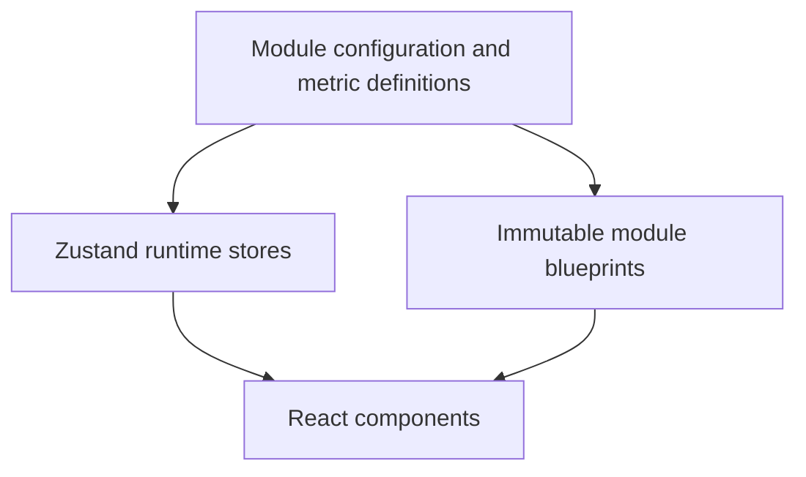

# Amelify

Amelify is a modular productivity hub in active development. The application is
designed around a customizable workspace where users can add productivity modules,
open them in a focused view, and eventually use their metrics in a shared scoring
system.

The current repository contains the Next.js frontend and the first iteration of the
module architecture. Backend, persistence, authentication, and AI features are
planned but are not implemented in this checkout.

## Contents

- [Current Status](#current-status)
- [Architecture](#architecture)
- [Implemented Features](#implemented-features)
- [Technology](#technology)
- [Project Structure](#project-structure)
- [Local Setup](#local-setup)
- [README Generator](#readme-generator)
- [Roadmap](#roadmap)
- [License](#license)

## Current Status

The frontend currently provides:

- A Next.js App Router application with authenticated and application route groups.
- A shared application shell with sidebar navigation.
- A Modules workspace containing module cards and focused module pages.
- An Add Module module that acts as the module catalog entry point.
- A first Habit Tracker module scaffold.
- Shared module card previews and metric slots.
- Zustand stores for module layout state and add-module state.

The project is still a UI and architecture prototype. Module data is held in memory,
and the current stores are not connected to a backend or database.

## Architecture

The frontend separates immutable module definitions from runtime state:


```mermaid
flowchart TD
    Config[Module configuration and metric definitions]
    Classes[Immutable module blueprints]
    Stores[Zustand runtime stores]
    Components[React components]
    Config --> Classes
    Config --> Stores
    Stores --> Components
    Classes --> Components
```

### Module Blueprints

Each module extends `BaseModule` and provides:

- Stable identity and title.
- Card configuration such as title visibility, options visibility, and metric slots.
- A page rendering contract.
- Optional settings behavior.

Card configuration is immutable. Runtime values such as active metric IDs, live
counts, filters, and user preferences belong in Zustand stores.

### Module Rendering

The shared module shell is responsible for consistent presentation:

- `ModuleCard` resolves an active module by ID.
- `ModuleCardFrame` renders the common card layout and controls.
- `ModuleCardPreview` reuses the same frame for catalog previews.
- `MetricSlots` renders up to two configured micro-variant metrics.
- `ModulePage` renders the focused module view.

## Implemented Features

### Module Workspace

The Modules route displays active modules in a responsive grid. Selecting a card
opens its focused page. The Add Module card remains fixed at the end of the grid.

### Add Module Flow

The Add Module page filters out modules already present in the workspace and shows
available modules using the same card frame as the main workspace. Each preview can
be selected to add that module to the in-memory module store.

### Metric Slots

Metric definitions provide an ID, display name, and micro variant renderer. The
shared slot component supports one or two metrics and enforces the card's maximum
metric count. The Add Module card is the first metric implementation.

### Habit Tracker

The Habit Tracker currently provides a module, page, settings contract, and catalog
entry. Habit data and its planned metrics are still under development.

## Technology

### Frontend

- Next.js with the App Router
- TypeScript
- React
- Tailwind CSS v4
- Zustand
- Lucide React icons

### Planned Infrastructure

The project logs describe future plans for:

- A NestJS backend.
- PostgreSQL and Prisma persistence.
- Supabase hosting.
- JWT authentication.
- Redis and BullMQ background jobs.
- Socket.IO real-time updates.
- AI-assisted features and retrieval-augmented generation.

These services are architectural plans, not currently available applications in this
repository.

## Project Structure

```text
.
├── frontend/
│   ├── app/                 # Next.js routes and layouts
│   ├── components/         # Shared layout and module-shell components
│   ├── config/              # Module catalog and static definitions
│   ├── modules/             # Concrete module implementations
│   ├── store/               # Zustand runtime state
│   └── types/               # Shared module contracts
├── logbook/                 # Project planning and development notes
├── scripts/                 # Repository maintenance scripts
├── CONTRIBUTING.md          # Engineering and contribution conventions
└── requirements.txt         # Python dependencies for the README generator
```

## Local Setup

### Requirements

- Node.js 20 or newer
- npm

### Frontend

From the repository root:

```bash
cd frontend
npm install
npm run dev
```

Open [http://localhost:3000](http://localhost:3000) in a browser.

Available frontend commands:

```bash
npm run lint
npm run build
npm run start
```

The production build currently depends on the route files under `frontend/app/`
being valid Next.js page modules.

## README Generator

The repository includes [`scripts/generate_readme.py`](scripts/generate_readme.py),
which combines the Markdown files in `logbook/` and asks Gemini to generate the root
README.

Install the Python dependencies from the repository root:

```bash
python -m pip install -r requirements.txt
```

Create a root `.env` file containing:

```env
GEMINI_API_KEY=your-api-key
```

Run the generator with the repository virtual environment when available:

```powershell
.\.venv\Scripts\python.exe scripts/generate_readme.py
```

The script writes directly to the root `README.md`. Generated output should be
reviewed before committing because the logbook contains both implemented work and
future plans.

## Roadmap

Planned work includes:

1. Complete the Habit Tracker's runtime data and metrics.
2. Add module-specific Zustand stores for live data and active metric selections.
3. Connect module settings to the card options menu.
4. Add persistent workspace and module data through a backend API.
5. Implement the shared scoring and Life Score engine.
6. Add authentication, AI assistance, and background processing.

## License

See [LICENSE](LICENSE) for the project license.
