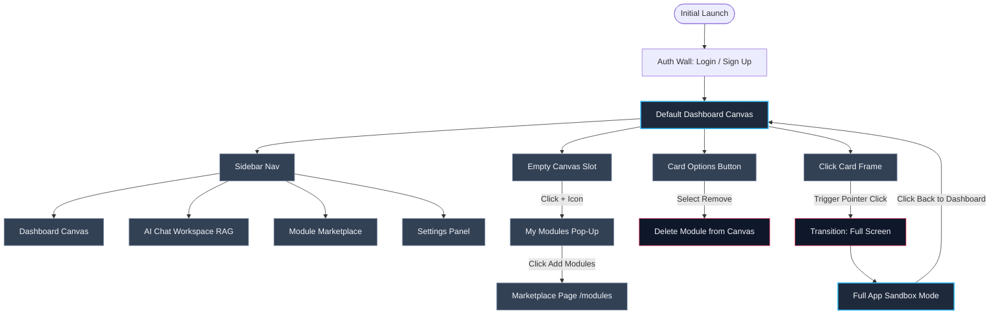

# 🗺️ System User Flow & Lifecycle

------------------------------
# 📐 Structural Layout & Component Breakdown
## 1. Left Command Sidebar (The Control Core)

* Top Element: App Logo. Acts as a persistent global reset switch that routes users directly back to the main dashboard canvas.
* Visual Separator: A clean, horizontal divider line spanning the width of the panel.
* Navigation Tree: A strict stack of textless high-density icons (or icon + text links) arranged vertically in this sequence:
1. Dashboard (Canvas layout)
2. AI Button (Conversational core)
3. Modules Button (Marketplace repository)
4. Settings Button (User parameters)

## 2. The Micro-Responsive Dashboard Canvas
The layout dynamically throttles column density depending on screen hardware variables while preserving row expansion:

* Large Screens: Fixed 3-column array, scrolling infinitely down the Y-axis.
* Medium Screens: Compressed 2-column array.
* Small Screens (Mobile): Single 1-column responsive stack.
* The Injection State: Initial deployment launches with one specialized empty placeholder box. This container embeds a single (+) Plus Icon centered vertically and horizontally.

## 3. Module Marketplace & Developer Pipeline (/modules)

* Global Search Utility: A heavy input field pinned to the absolute top of the page viewport for rapid structural queries.
* The Marketplace Canvas: Employs the exact same 3/2/1 responsive bento-box grid matching the dashboard. Cards render real-time UI previews displaying standard template mockups of the module's behavior.
* The Open Source Hook: A call-to-action button pinned on the page that provides an outbound anchor link directly to the GitHub documentation repository, instructing creators how to write customized layout plugins.

## 4. The Centralized RAG AI Space (/ai)

* Mirrors standard, industrial conversation portals (similar to ChatGPT or Claude).
* Features a persistent chat layout with an input prompt at the bottom and a streaming scrollback container anchoring conversational message nodes.

## 5. User Profiling Workspace (/settings)

* Isolated layout view containing account controls, data management flags, and security settings.

------------------------------
# 🕹️ State Interactions & Card Lifecycle
## State A: Preview Mode (The Dashboard Grid)

* All module canvas elements are hard-bound to equal square dimensions.
* Management Utility: Every card hosts an options context toggle button pinned permanently to the top-right bounding corner allowing swift removal.
* Rearrangement Engine: Long-pressing or holding down a pointer click fires a state mutation transforming the canvas to an active edit mode. The card locks to the cursor, enabling live drag-and-drop orchestration across coordinates, forcing neighboring grid cards to wrap around the active bounding target dynamically.

## State B: Expansion Mode (The Application Sandbox)

* Clicking a module card bypasses the grid shell, deploying a smooth full-viewport display transition.
* Navigation Guard: The header introduces a structural anchor navigation element in the top-left reading ← Back to Dashboard.
* Functional Scope: The module escapes the grid constraint, functioning as an expansive, isolated single-page application with data-dense mechanics and internal dashboard view routes.

